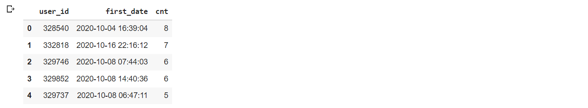

# Retention

## Датасет
Пользователи платят за доступ к облачному хранилищу (таблица payments). Доступ можно купить на
разное количество дней (поле days). По пользователям есть агрегированная по дням статистика
(таблица downloads) c количеством скачанных за день файлов (поле downloads).


## Задача
Мы считаем ретеншн как процент пользователей, возвращающихся на сервис и что-либо
скачивающих в определенный день после покупки доступа. Напишите SQL-запрос, рассчитывающий
ретеншн первых 10 дней у пользователей, совершивших первую покупку после 1 октября 2020 года.
Интересуют скачивания только в оплаченные дни. Ожидаемый формат вывода:

<table>
   <tr>
      <td>Номер дня</td>
      <td>Retention</td>
   </tr>
  <tr>
      <td>0</td>
      <td>0,97</td>
   </tr>
  <tr>
      <td>1</td>
      <td>0,57</td>
   </tr>
  <tr>
      <td>...</td>
      <td>...</td>
   </tr>
</table>

В датасете упрощенные сгенерированные данные — не обращайте внимания на выбросы и перекосы,
тест именно на владение SQL, а не на аналитику данных. Датасет доступен в виде дампа
MySQL-таблиц . По запросу можем предоставить доступ к тестовой БД. Важно! Если разворачиваете
дамп — пожалуйста не модифицируйте датасет и не создавайте дополнительных таблиц и вьюшек,
чтобы ваш запрос можно было проверить на тестовой БД с доступом только на чтение.

## Решение

Интересно, будет ли разным результат, если мы будем считать не число пользователей (учитывая только их первую покупку), а в целом покупки после 1 октября 2020 года, какой в этом есть бизнес смысл?

```sql
```


## Разбор

**1)** Пользователи, совершившие первую покупку после 1 октября 2020 года, и количество покупок.
```sql
SELECT  user_id, min(date_paid) as first_date, count(*) as cnt 
FROM payments 
GROUP BY user_id
HAVING MIN(date_paid) >= "2020-10-01" 
ORDER BY cnt DESC
LIMIT 5
```

 
<table>
   <tr>
      <td>❓</td>
      <td>
         Напишите запрос, что бы проверить, что у пользователя user_id = 328540 было 8 покупок
      </td>
   </tr>
</table>

**2)** Сколько таких пользователей

```sql
WITH filtered_users AS ( 
  SELECT user_id, min(date_paid) as first_date 
  FROM payments 
  GROUP BY user_id
  HAVING MIN(date_paid) >= "2020-10-01" )
 
SELECT COUNT(*) 
FROM filtered_users
```
<table>
   <tr>
      <td></td>
      <td>
         COUNT(*)
      </td>
   </tr>
   <tr>
      <td>0</td>
      <td>
         17037
      </td>
   </tr>
</table>


