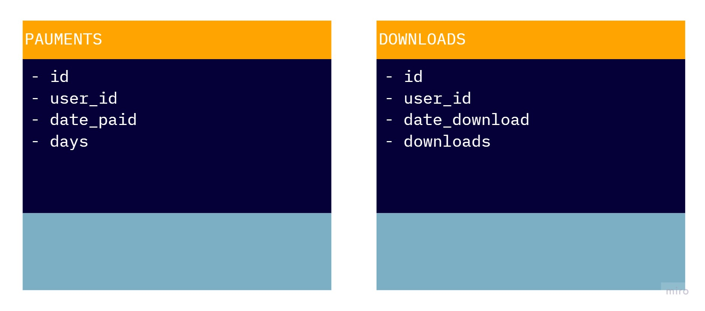

# Retention

## Датасет
Пользователи платят за доступ к облачному хранилищу (таблица payments). Доступ можно купить на
разное количество дней (поле days). По пользователям есть агрегированная по дням статистика
(таблица downloads) c количеством скачанных за день файлов (поле downloads).

## Задача
Мы считаем ретеншн как процент пользователей, возвращающихся на сервис и что-либо
скачивающих в определенный день после покупки доступа. Напишите SQL-запрос, рассчитывающий
ретеншн первых 10 дней у пользователей, совершивших первую покупку после 1 октября 2020 года.
Интересуют скачивания только в оплаченные дни. Ожидаемый формат вывода:

<table>
   <tr>
      <td>Номер дня</td>
      <td>Retention</td>
   </tr>
  <tr>
      <td>0</td>
      <td>0,97</td>
   </tr>
  <tr>
      <td>1</td>
      <td>0,57</td>
   </tr>
  <tr>
      <td>...</td>
      <td>...</td>
   </tr>
</table>
